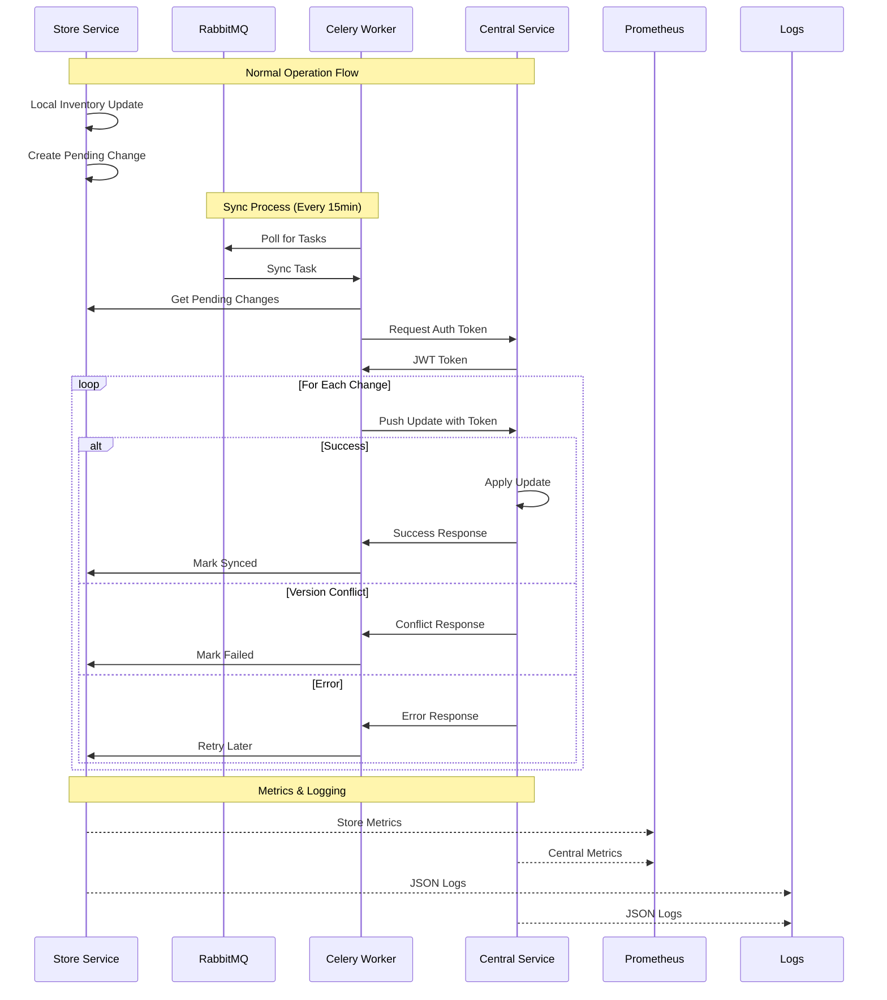

# Services
For more information about the services, in each folder `central_services` and `store_services`

Also, like in this moment is only a prototype (and a technical test), we don't worry about the variables inside the `.env` file,
all of this is fake and don't compromise the security. If the implementation is for real world, all the file .env should be added to the
.gitignore and use safe measures like GITHUB_SECRETS or secret manager in the cloud.

## High level diagram


## How to use.

To create the local database, we need to use alembic and a script to populate the db (for the moment, the db is already created and populate)

```sh
uv run alembic upgrade head
uv run python -m scripts.populate_inventory
```

This is needed to do in the folder `central_services` and `store_services`.

To deploy everything, you need to go to the folder deploy, here is the docker compose with the services of rabbitmq, central_services, store_services, celery worker/beat, and flower.

To build the docker compose you can do with the following commands:

```sh
docker compose -f 'deploy/docker-compose.yml' up -d --build 
```

### How to update local inventory

To update the local inventory, we need to go to http://localhost:8001/docs, to use the OpenAPI/Swagger. Here with the endpoint `/v1/local/inventory/{sku}/update`, you can choose a SKU from the database (example: ELEC-LAPTOP-001 or ELEC-GAME-007).

The delta is the change in the inventory, when a positive number is an addition, a negative is a reservation, the operation_id is generated automatically, and the version is the version in the central db.

```http
POST /v1/local/inventory/{sku}/update
{
  "delta": 1,
  "version": 0,
  "operation_id": "28575de9-5662-4cfb-af2e-e309e281f2a5"
}

```

If you want to know how is the operation for the update, you can use the follow endpoints:

```http
<!-- To get the Operation id by SKU, if you don't remember -->
GET /v1/local/inventory/{sku}/operation_id

<!-- To the get the status -->
GET /v1/local/sync/status/{operation_id}
```


Also, if you don't want to wait 15 minutes to sync in the background, you can trigger the sync with the endpoint `/v1/local/sync/trigger`

