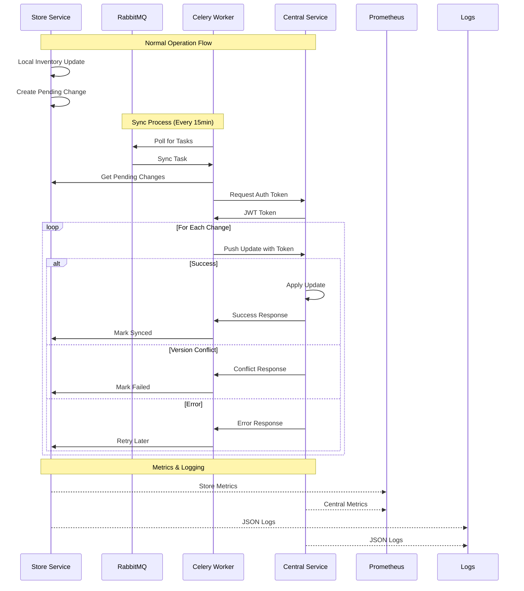

```mermaid
sequenceDiagram
    participant Store as Store Service
    participant Queue as RabbitMQ
    participant Worker as Celery Worker
    participant Central as Central Service
    
    Note over Store,Central: Normal Operation Flow
    Store->>Store: Local Inventory Update
    Store->>Store: Create Pending Change
    
    Note over Queue,Worker: Sync Process (Every 15min)
    Worker->>Queue: Poll for Tasks
    Queue->>Worker: Sync Task
    Worker->>Store: Get Pending Changes
    
    Worker->>Central: Request Auth Token
    Central->>Worker: JWT Token
    
    loop For Each Change
        Worker->>Central: Push Update with Token
        alt Success
            Central->>Central: Apply Update
            Central->>Worker: Success Response
            Worker->>Store: Mark Synced
        else Version Conflict
            Central->>Worker: Conflict Response
            Worker->>Store: Mark Failed
        else Error
            Central->>Worker: Error Response
            Worker->>Store: Retry Later
        end
    end
    
    Note over Store,Central: Metrics & Logging
    Store-->>Prometheus: Store Metrics
    Central-->>Prometheus: Central Metrics
    Store-->>Logs: JSON Logs
    Central-->>Logs: JSON Logs
```