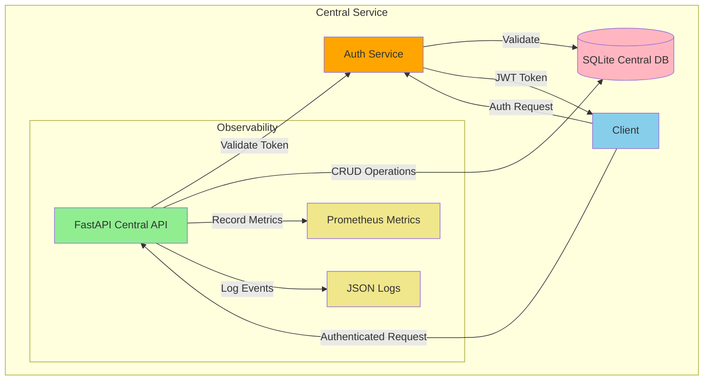

```mermaid
flowchart TB
    subgraph Central Service
        API[FastAPI Central API]
        DB[(SQLite Central DB)]
        Auth[Auth Service]
        
        Client -->|Auth Request| Auth
        Auth -->|Validate| DB
        Auth -->|JWT Token| Client
        
        Client -->|Authenticated Request| API
        API -->|Validate Token| Auth
        API -->|CRUD Operations| DB
        
        subgraph Observability
            Prom[Prometheus Metrics]
            Logs[JSON Logs]
            API -->|Record Metrics| Prom
            API -->|Log Events| Logs
        end
    end

    style API fill:#90EE90
    style DB fill:#FFB6C1
    style Auth fill:#FFA500
    style Client fill:#87CEEB
    style Prom fill:#F0E68C
    style Logs fill:#F0E68C
```