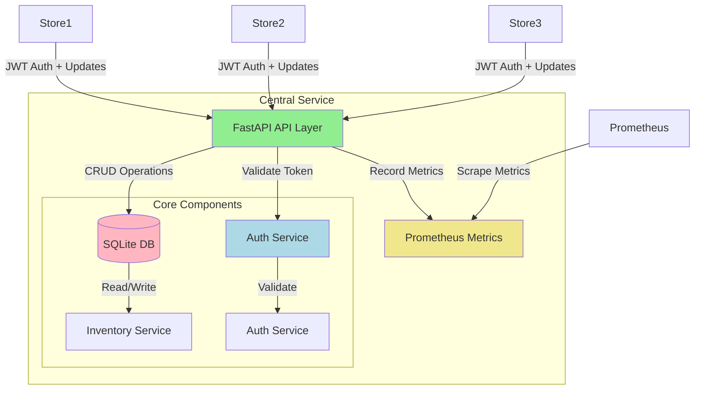

# Central Services

Central coordination service for distributed inventory management system. Provides the source of truth for inventory state and handles synchronization with store services.

## Architecture Overview



## Technology Stack

- **Framework**: FastAPI
- **Database**: SQLite with async support (aiosqlite)
- **ORM**: SQLAlchemy (async)
- **Authentication**: JWT-based service authentication
- **Metrics**: Prometheus
- **Logging**: JSON structured logging

## Core Features

1. **Inventory Management**
   - Source of truth for inventory quantities
   - Optimistic concurrency control
   - Version tracking for conflict resolution

2. **Service Authentication**
   - JWT-based authentication for store services
   - Service-specific secrets and roles
   - Token expiration and refresh

3. **Observability**
   - Prometheus metrics for operations
   - Structured JSON logging
   - Health check endpoints

## API Design

### Main Endpoints

#### Authentication
```http
POST /auth/token
Content-Type: application/json

{
    "service_name": "store-1",
    "service_secret": "secret"
}
```

#### Inventory Operations
```http
# Get inventory state
GET /v1/inventory/{sku}
Authorization: Bearer <token>

# Update inventory
POST /v1/inventory/{sku}/adjust
Authorization: Bearer <token>
Idempotency-Key: <operation_id>

{
    "sku": "ABC123",
    "delta": -1,
    "version": 1
}

# Bulk sync
POST /v1/inventory/bulk-sync
Authorization: Bearer <token>

{
    "items": [
        {
            "sku": "ABC123",
            "delta": -1,
            "version": 1,
            "operation_id": "uuid"
        }
    ]
}
```

## Architectural Decisions

### Consistency over Availability

The system prioritizes consistency over availability for several reasons:

1. **Business Requirements**
   - Inventory accuracy is critical for retail operations
   - Overselling must be prevented
   - Financial implications of inventory errors

2. **Technical Implementation**
   - Optimistic locking with version tracking
   - Idempotent operations with operation IDs
   - Explicit conflict handling with current state feedback

3. **Conflict Resolution**
   - Version conflicts return current state
   - Stores can resolve conflicts with local compensation
   - Bulk operations handle conflicts individually

### Key Design Patterns

1. **Optimistic Concurrency**
   - Version-based concurrency control
   - No long-term locks
   - Fast operations in non-conflict scenarios

2. **Idempotency**
   - Operation IDs for deduplication
   - 24-hour idempotency key retention
   - Safe retry handling

3. **Bounded Concurrency**
   - Semaphore-limited parallel processing
   - Protection against resource exhaustion
   - Configurable concurrency limits

## Setup and Running

1. Create virtual environment:
```bash
python -m venv .venv
source .venv/bin/activate  # or .venv\Scripts\activate on Windows
```

2. Install dependencies:
```bash
pip install -e .
```

3. Configure environment:
```bash
cp .env.example .env
# Edit .env with your settings
```

4. Run the service:
```bash
uvicorn app.main:app --host 0.0.0.0 --port 8000 --reload
```

## Integration with Store Services

The central service integrates with store services through:

1. **Authentication Flow**
   - Store services request JWT tokens
   - Tokens used for all subsequent requests
   - Automatic token refresh handling

2. **Inventory Updates**
   - Atomic updates with version checking
   - Bulk sync support for efficiency
   - Conflict resolution with current state

3. **Monitoring**
   - Centralized metrics collection
   - Operation success/failure tracking
   - Performance monitoring

## Monitoring and Observability

Access monitoring endpoints:

- Metrics: http://localhost:8000/metrics
- Health: http://localhost:8000/health
- API Docs: http://localhost:8000/docs

## Development

Run tests:
```bash
pytest
```

Run linting:
```bash
ruff check .
```