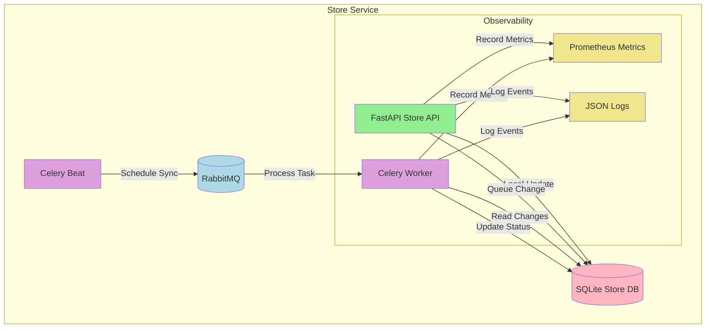

```mermaid
flowchart TB
    subgraph Store Service
        API[FastAPI Store API]
        DB[(SQLite Store DB)]
        Celery[Celery Worker]
        Beat[Celery Beat]
        Queue[(RabbitMQ)]
        
        API -->|Local Update| DB
        API -->|Queue Change| DB
        Beat -->|Schedule Sync| Queue
        Queue -->|Process Task| Celery
        Celery -->|Read Changes| DB
        Celery -->|Update Status| DB
        
        subgraph Observability
            Prom[Prometheus Metrics]
            Logs[JSON Logs]
            API -->|Record Metrics| Prom
            Celery -->|Record Metrics| Prom
            API -->|Log Events| Logs
            Celery -->|Log Events| Logs
        end
    end

    style API fill:#90EE90
    style DB fill:#FFB6C1
    style Queue fill:#ADD8E6
    style Celery fill:#DDA0DD
    style Beat fill:#DDA0DD
    style Prom fill:#F0E68C
    style Logs fill:#F0E68C
```