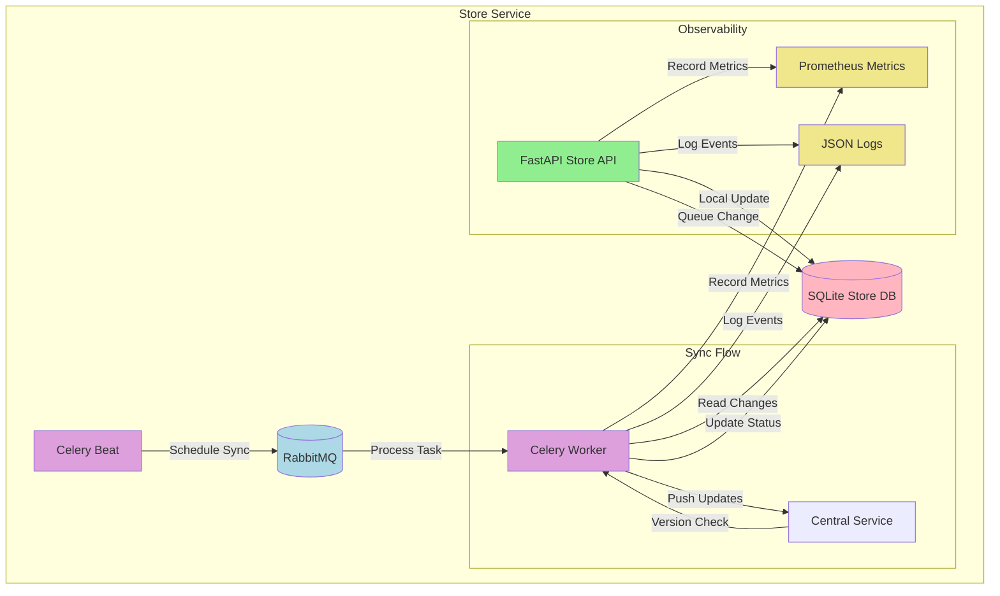

# Store Service

Local inventory management service designed to operate in a distributed system. Handles local inventory updates and synchronizes with the central service.

## Architecture Overview



## Technology Stack

- **Framework**: FastAPI
- **Database**: SQLite with async support (aiosqlite)
- **ORM**: SQLAlchemy (async)
- **Task Queue**: Celery with RabbitMQ
- **Authentication**: JWT client
- **Metrics**: Prometheus
- **Logging**: JSON structured logging

## Core Features

1. **Local Inventory Management**
   - Fast local updates
   - Optimistic concurrency
   - Queued changes tracking

2. **Central Sync**
   - Background synchronization with retries
   - Conflict detection and resolution
   - Idempotent operations

3. **Observability**
   - Prometheus metrics
   - Structured logging
   - Health checks
   - Worker status monitoring

## API Design

### Main Endpoints

#### Local Inventory Operations
```http
# Get local inventory
GET /v1/local/inventory/{sku}

# Update local inventory
POST /v1/local/inventory/{sku}/update

{
    "delta": -1,
    "operation_id": "uuid",
    "version": 1
}

# Check sync status
GET /v1/local/sync/status/{operation_id}

# Trigger sync manually
POST /v1/local/sync/trigger
```

## Architectural Decisions

### Local-First with Eventually Consistent Central Sync

The store service implements a local-first approach with eventual consistency:

1. **Fast Local Operations**
   - Immediate local updates
   - Local version tracking
   - Change queue for sync

2. **Background Synchronization**
   - Scheduled sync every 15 minutes
   - Exponential backoff for retries
   - Conflict resolution strategies

3. **Failure Handling**
   - Queued changes persist across restarts
   - Operation tracking with status
   - Conflict resolution with central version

### Key Design Patterns

1. **Change Tracking**
   - Pending changes queue
   - Operation IDs for tracking
   - Status updates for visibility

2. **Worker Architecture**
   - Celery for reliable processing
   - RabbitMQ for message durability
   - Beat scheduling for consistency

3. **Health Monitoring**
   - Worker health checks
   - Queue monitoring
   - Sync status tracking

## Setup and Running

1. Create virtual environment:
```bash
uv init .
```

2. Install dependencies:
```bash
uv sync
```

4. Run components:
```bash
# API Service
uv run fastapi dev app/main.py
```

## Integration with Central Service

The store service integrates with the central service through:

1. **Authentication**
   - JWT token acquisition
   - Token refresh handling
   - Service identity management

2. **Sync Process**
   - Batch updates for efficiency
   - Version conflict handling
   - Idempotent operations

3. **Health Checks**
   - RabbitMQ connection monitoring
   - Central service availability
   - Worker process health

## Monitoring and Observability

Access monitoring endpoints:

- Metrics: http://localhost:8001/metrics
- Health: http://localhost:8001/health
- API Docs: http://localhost:8001/docs

Monitor worker health:
```bash
python bin/worker_healthcheck.py
```

## Development

Run tests:
```bash
uv run pytest
```

Run linting:
```bash
uv run ruff check .
```

## Docker Support

Run with Docker Compose:
```bash
docker-compose up -d
```

Service Components:
- FastAPI service
- Celery worker
- Celery beat
- RabbitMQ

## Service Credentials
### Service 1:
- Service name: inventory-service
- service credentials: qlDKAOp65mSGgtNNjMVRZO1bBPgDS5ArhZYc+YF1cjA=
### Service 2:
- Service name: order-service
- ZJwzHrsaeQBckoBpMmrIoyiVJlSI+DJLfb5yt2wVtVo=

This is important, because when you want to query the status of the inventory in the central, you need a Bearer token, this is gotten in the central services.

```http
POST /auth/token

{
  "service_name": "string",
  "service_secret": "string"
}
```